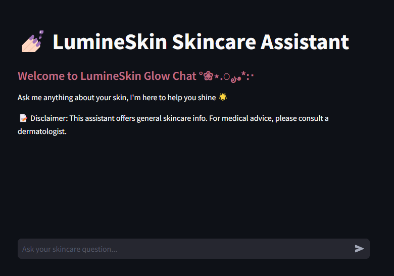

#### 💅🏻 LumineSkin AI Skincare Assistant

A Retrieval-Augmented Generation (RAG) chatbot built to **educate**, **guide**, and **personalize skincare** for customers in real time. Whether you want to suggest products, generate skin routines, or answer ingredient-specific queries this AI assistant does it with clarity and confidence.



---

## Why LumineSkin?

Most chatbots are rule-based and limited to FAQs. LumineSkin's AI assistant is powered by **RAG**, meaning it doesn't just respond — it **retrieves your brand's actual data** and **generates intelligent answers** based on it.

Customers can:
- Get personalized skincare routines (morning/night)
- Compare products & ingredients
- Ask skin-type-specific questions
- Understand how and when to use products
- Stay within your brand ecosystem (no misleading blogs!)

---

## What is RAG?

**RAG (Retrieval-Augmented Generation)** combines:
- A powerful **LLM** (language model) to generate natural responses
- A **vector database** that retrieves relevant product or FAQ content from your brand

It ensures the chatbot answers **accurately, safely, and on-brand** no hallucinated info.

---

## ⚙️ Tech Stack

| Tool        | Purpose                              |
|-------------|--------------------------------------|
| **Groq** | Language model to generate answers   |
| **Pinecone**   | Vector DB to store & search embeddings |
| **LangChain**  | Build the RAG pipeline              |
| **Streamlit**  | Interactive chatbot UI              |

---

## 🚀 Run Locally

### 1. Clone the repo
      ```bash
         git clone https://github.com/kavyaa-tech/bhasavidvamsu.git
         cd bhasavidvamsu

### 2. Install dependencies
         ```bash
         pip install -r requirements.txt

 ### 3. Set environment variables
        ```bash      
        GROQ_API_KEY=your key
        PINECONE_API_KEY=your key
        PINECONE_ENV=your key
        PINECONE_INDEX=your key

### 4. Run the app
          ```bash
          streamlit run app/app.py


# Example Queries
- “What’s the right routine for oily skin?”
- “Can I use Niacinamide and Salicylic Acid together?”
- “Give me a list of serums in your brand.”
- “What ingredients are in SunVeil SPF 50?”

#Features & Deployment
- Streamlit-based interactive UI
- RAG chatbot built on real product data
- Works with markdown, text, or CSV docs
- Brand-safe and educative
- Includes in-app disclaimer for medical advice
- Easy to plug into other industries (boutiques, cooking, wellness, etc.)

# Demo & Links
- [Watch the Demo]()
- [Live App](https://lumineskin-ai.streamlit.app/)

# ✨ About the Creator
Hey there I'm an aspiring AI Engineer passionate about building meaningful AI tools for brands. With this project, I'm exploring how RAG powered assistants can transform the e-commerce customer experience.

If you're looking to:

Hire for AI, LLM, or chatbot work

Add a smart assistant to your brand

Collaborate on custom AI tools

📩 Let’s connect on LinkedIn I’d love to hear from you!


Disclaimer
The LumineSkin Assistant is for educational/informational purposes only. It is not a substitute for professional medical advice. Please consult a licensed dermatologist before starting any new skincare routine.


